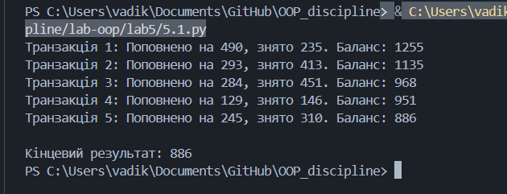
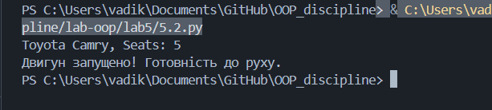
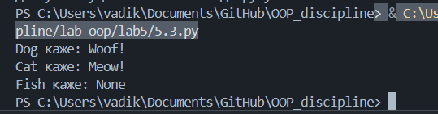
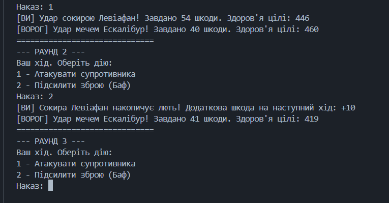

# Звіт до роботи
### Мета роботи: Ознайомитись з ключовими поняттями об’єктно-орієнтованого програмування (ООП) у Python та навчитися реалізовувати їх у власних класах на прикладі ігрової симуляції.
### Хід роботи:

### 1. Інкапсуляція:
```

import random

class BankAccount:
    def __init__(self, owner, balance):
        self.owner = owner  # публічний атрибут
        self.__balance = balance  # приватний атрибут

    def deposit(self, amount):
        self.__balance += amount

    def withdraw(self, amount):
        if amount <= self.__balance:
            self.__balance -= amount
            return amount
        else:
            return "Insufficient funds"

    def get_balance(self):
        return self.__balance

account = BankAccount("Bohdan", 1000)

for i in range(5):
    # Випадкове поповнення та зняття
    dep = random.randint(100, 500)
    wit = random.randint(50, 600)
    
    account.deposit(dep)
    account.withdraw(wit)
    print(f"Транзакція {i+1}: Поповнено на {dep}, знято {wit}. Баланс: {account.get_balance()}")

print(f"\nКінцевий результат: {account.get_balance()}")

```

### Програма вивела:


### 2.Наслідування:
```
class Vehicle:
    def __init__(self, brand, model):
        self.brand = brand
        self.model = model

    def display_info(self):
        return f"{self.brand} {self.model}"
        
    def start_engine(self):
        return "Двигун запущено! Готовність до руху."

class Car(Vehicle):
    def __init__(self, brand, model, seats):
        super().__init__(brand, model)
        self.seats = seats

    def display_info(self):
        return f"{super().display_info()}, Seats: {self.seats}"

car = Car("Toyota", "Camry", 5)
print(car.display_info())
# Виклик нового методу з базового класу
print(car.start_engine())
```
### Програма вивела:


### 3.Поліморфізм:
```
class Animal:
    def speak(self):
        pass

class Dog(Animal):
    def speak(self):
        return "Woof!"

class Cat(Animal):
    def speak(self):
        return "Meow!"

class Fish(Animal):
    pass # Метод не перевизначено

animals = [Dog(), Cat(), Fish()]
for animal in animals:
    print(f"{animal.__class__.__name__} каже: {animal.speak()}")
```
### Програма вивела:


### 4.Симуляція тактичного бою:
```
from abc import ABC, abstractmethod
from random import randint, choice

class Item(ABC):
    def __init__(self, name:str, health = 500):
        self.name = name
        self.health = health
    
    @abstractmethod
    def attack(self, another_item):
        pass
        
    @abstractmethod
    def buff(self):
        pass

class Sword(Item):
    def __init__(self, name, attack_power:int):
        super().__init__(name=name)
        self.__attack_power = attack_power
        self._sharp = 0
    
    def attack(self, another_item:Item):
        current_attack = self.__attack_power + self._sharp + randint(0, 10)
        another_item.health -= current_attack
        # Після удару гострота трохи падає
        if self._sharp > 0: self._sharp -= 1 
        return f"Удар мечем {self.name}! Завдано {current_attack} шкоди. Здоров'я цілі: {another_item.health}"
    
    def buff(self):
        self._sharp += 5
        return f"Меч {self.name} заточено. Бонус до атаки: +{self._sharp}"

class Axe(Item):
    def __init__(self, name, attack_power:int):
        super().__init__(name=name)
        self.__attack_power = attack_power
        self._rage = 0
    
    def attack(self, another_item:Item):
        current_attack = self.__attack_power + self._rage + randint(0, 20)
        another_item.health -= current_attack
        self._rage = 0 # Скидання люті після удару
        return f"Удар сокирою {self.name}! Завдано {current_attack} шкоди. Здоров'я цілі: {another_item.health}"

    def buff(self):
        self._rage += 10
        return f"Сокира {self.name} накопичує лють! Додаткова шкода на наступний хід: +{self._rage}"

class Bow(Item):
    def __init__(self, name, attack_power:int, range_power:int = 0):
        super().__init__(name=name)
        self.__attack_power = attack_power
        self.range_power = range_power
    
    def attack(self, another_item:Item):
        current_attack = self.__attack_power + randint(5, 15) + self.range_power
        another_item.health -= current_attack
        return f"Постріл з лука {self.name}! Завдано {current_attack} шкоди. Здоров'я цілі: {another_item.health}"
    
    def reload(self):
        self.range_power += 2
        return f"Лук {self.name} натягнуто сильніше. Дальність: +{self.range_power}"
        
    def buff(self):
        return self.reload()

# --- ПІДГОТОВКА ДО БОЮ ---
armory = [
    Sword("Ескалібур", 40),
    Axe("Левіафан", 45),
    Bow("Шепіт Вітру", 30)
]

# Випадковий вибір зброї
player_weapon = choice(armory)
armory.remove(player_weapon)
enemy_weapon = choice(armory)

print("=== БОЙОВЕ ЗВЕДЕННЯ ===")
print(f"Ваш інвентар: {player_weapon.__class__.__name__} '{player_weapon.name}' (HP: {player_weapon.health})")
print(f"Ворожий інвентар: {enemy_weapon.__class__.__name__} '{enemy_weapon.name}' (HP: {enemy_weapon.health})\n")

# --- БОЙОВИЙ ЦИКЛ ---
round_num = 1
while player_weapon.health > 0 and enemy_weapon.health > 0:
    print(f"--- РАУНД {round_num} ---")
    
    # Хід користувача
    print("Ваш хід. Оберіть дію:")
    print("1 - Атакувати супротивника")
    print("2 - Підсилити зброю (Баф)")
    
    action = input("Наказ: ")
    
    if action == '1':
        print(f"[ВИ] {player_weapon.attack(enemy_weapon)}")
    elif action == '2':
        print(f"[ВИ] {player_weapon.buff()}")
    else:
        print("[ВИ] Некоректний наказ! Пропуск ходу.")
        
    if enemy_weapon.health <= 0:
        print(f"\nСупротивника ліквідовано! Перемога за {player_weapon.name}!")
        break
        
    # Хід противника (штучний інтелект)
    enemy_action = randint(1, 4) # 25% шанс на баф, 75% на атаку
    if enemy_action == 1:
        print(f"[ВОРОГ] {enemy_weapon.buff()}")
    else:
        print(f"[ВОРОГ] {enemy_weapon.attack(player_weapon)}")

    if player_weapon.health <= 0:
        print(f"\nВашу зброю знищено. Місію провалено. Перемога за {enemy_weapon.name}!")
        break
        
    round_num += 1
    print("=" * 30)
```
### Програма вивела:

