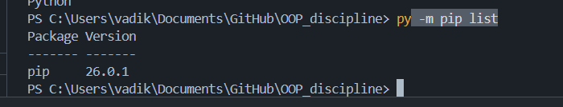
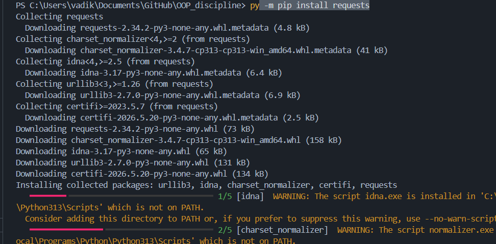
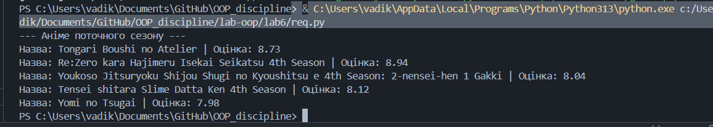
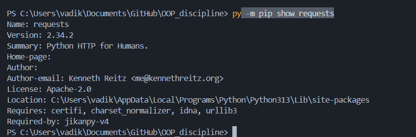

# Звіт з практичної роботи: Віртуальні середовища та робота зі сторонніми бібліотеками

**Виконав:** студент групи КН-31 Рекунов В. В.

---

## 1. Основи роботи зі сторонніми бібліотеками (PIP)

Я перевірив роботу пакетного менеджера `pip`. За допомогою команд `pip -V` та `pip --help` я дізнався версію інструменту та переглянув доступні команди. Також вивів перелік встановлених бібліотек.

Далі я встановив бібліотеку `requests`. Тестовий запит до google.com пройшов успішно і повернув статус-код 200. Окрім методу `get`, ця бібліотека дозволяє використовувати `post` (для відправки даних), `put` (для оновлення) та `delete` (для видалення).

Також я попрацював з `jikanpy` та `Flask`. Спочатку запустив готовий код для отримання оцінок епізодів аніме, а потім написав скрипт, який шукає і виводить серіали поточного сезону.

---

## 2. Робота у віртуальному середовищі (VENV)

Я створив ізольоване віртуальне середовище. Після його активації перевірив розташування `requests` через команду `pip show requests`. Бібліотека встановилася локально в папку середовища, а не в систему комп'ютера. Це забезпечує незалежність проєкту.

---

## 3. Управління через Pipenv

Я розгорнув ще одне середовище, цього разу через `pipenv`. Переконався, що файл `Pipfile` зберігає список потрібних пакетів, а `Pipfile.lock` фіксує їхні точні версії для безпечного перенесення на інші пристрої.

Під час роботи лінтер `flake8` знайшов кілька дрібних стилістичних помилок (наприклад, зайві пробіли). Я їх виправив, і повторна перевірка пройшла успішно. 
Перевірка на вразливості (`pipenv check --scan`) теж не виявила проблем — система видала `All good!`.

---

## 4. Робота зі змінними середовища

Я протестував змінні середовища. Коли спробував запустити скрипт без активації віртуального середовища, отримав помилку `KeyError` для змінної `IT_TEST`. Це означає, що дані з файлу `.env` підтягуються лише тоді, коли середовище `pipenv` увімкнене.

---

## 5. Poetry та Flask

Наприкінці я створив проєкт через пакетний менеджер `poetry`. Ініціалізував середовище, додав `flask` та `jikanpy`. За допомогою ШІ я згенерував веб-програму, яка виводить список епізодів аніме. Сервер успішно запустився у віртуальному середовищі, і результат відобразився у браузері.

> [Місце для скріншоту: сторінка запущеного Flask сервера у браузері]

---
**Висновок:** Роботу виконано. Я на практиці навчився працювати з менеджерами пакетів (pip, pipenv, poetry), створювати віртуальні середовища та керувати залежностями проєкту.