# 🤖 AI Агенти з Google ADK

## 📌 Тема роботи
Створення AI агентів з використанням Google Agent Development Kit (ADK) та Python (Poetry для управління залежностями).

## 🎯 Мета роботи
Навчитись створювати AI агентів, використовувати інструменти (tools), працювати з моделями Gemini, налаштовувати workflow агентів та зберігати контекст.

## 🛠️ Використані технології
Python 3.13+, Poetry, Google ADK, Gemini API, python-dotenv


## ⚙️ Версії середовища
python --version → Python 3.13.x  
poetry --version → Poetry x.x.x  
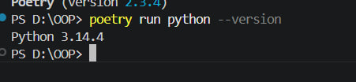
## 📦 Встановлення
poetry init  
poetry add google-adk python-dotenv  
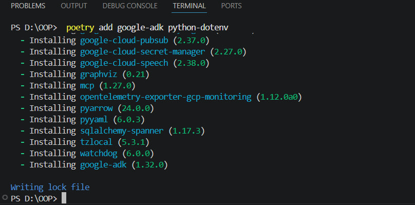

Файл poetry.lock потрібен для фіксації версій залежностей, щоб проєкт працював однаково на різних ПК.

## 🤖 АГЕНТИ

### 1. Time Agent
Функція: показує поточний час у місті  
Tool: get_current_time(city)

Agent клас — це базовий клас для створення AI агента, який підключається до моделі Gemini.  
tools — це функції Python, які агент може викликати як інструменти.  
get_current_time — повертає поточний час (демо-реалізація через datetime).

Результат: агент відповідає на питання про час у різних містах.
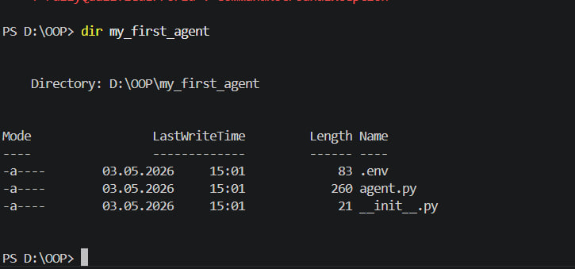
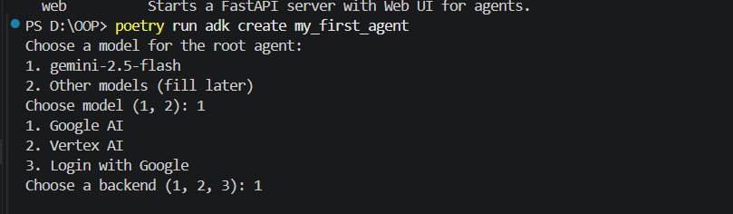
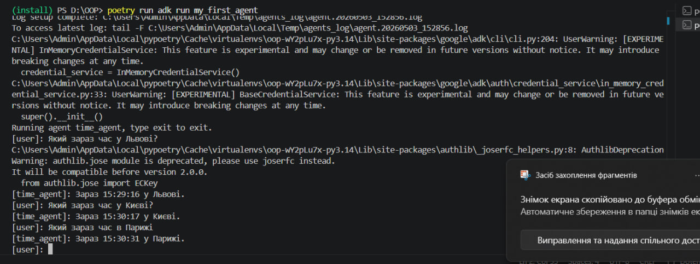

---

### 2. Math Agent
Функції:
- площа прямокутника
- площа кола
- обʼєм куба

Додатково:  обʼєм циліндра 
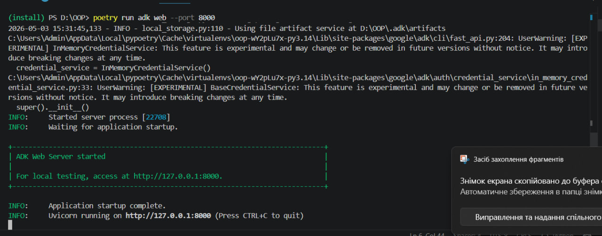
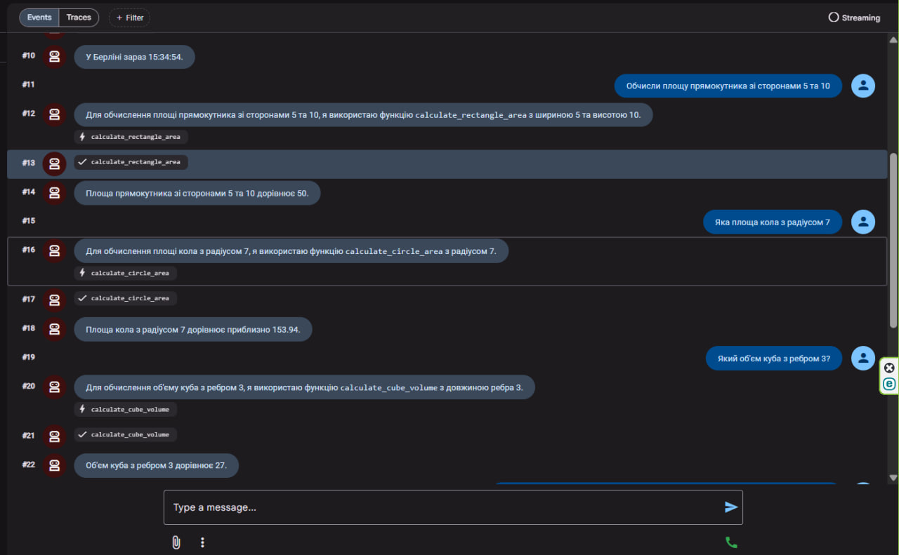
```

def calculate_cylinder_volume(radius, height):
    """
    Обчислює об'єм циліндра.
    :param radius: радіус основи
    :param height: висота циліндра
    :return: об'єм
    """
    if radius < 0 or height < 0:
        return "Помилка: значення не можуть бути від'ємними"
    
    volume = math.pi * pow(radius, 2) * height
    return round(volume, 2)

# Приклад використання:
r = 5
h = 10
print(f"Об'єм циліндра: {calculate_cylinder_volume(r, h)}")
```
Результат: агент виконує математичні обчислення через tools.

---

### 3. Student Helper
Функції:
- explain_concept()
- check_syntax()

Можливості:
- пояснення Python концепцій
- перевірка коду
- навчальні відповіді
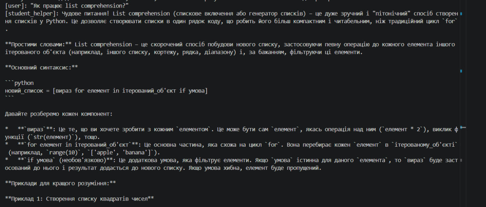
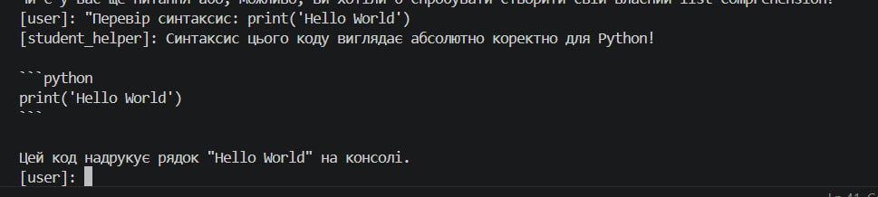
---

### 4. Creative Writer
Налаштування:
temperature = 1.5  
top_k = 40  
top_p = 0.95  
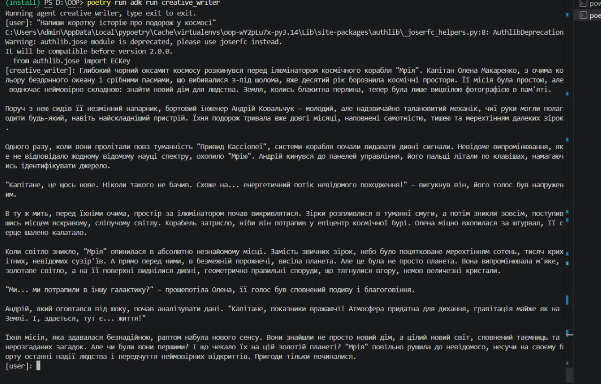
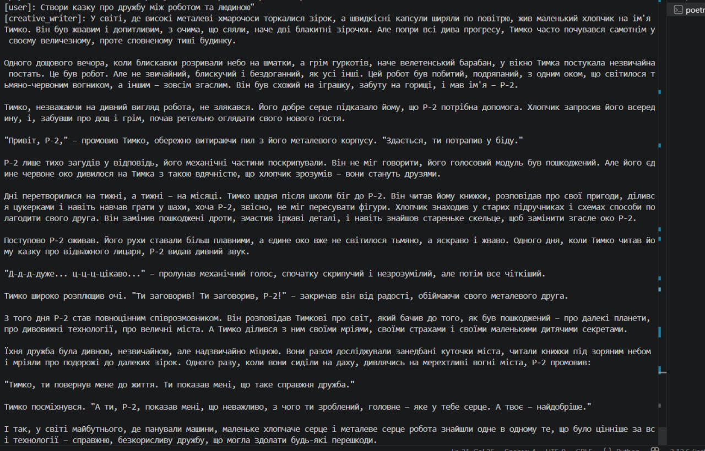
Результат: креативні історії з персонажами та сюжетом.

---

### 5. Conversation Agent
Функції:
- save_user_preference()
- recall_preference()
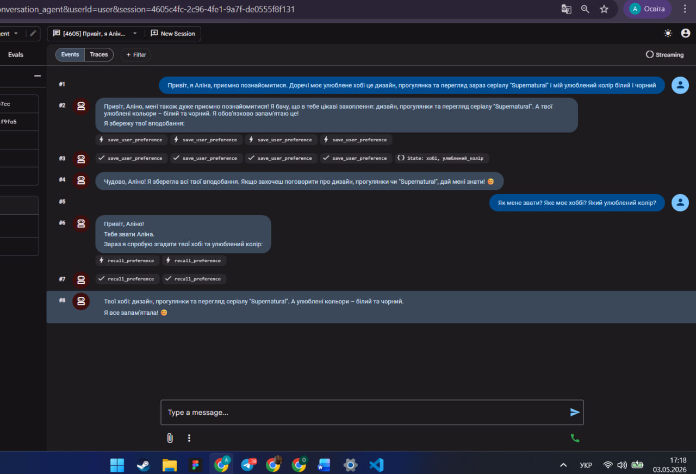
Можливості:
- памʼять імені
- хобі
- кольору
- контексту розмови
---
## 📁 Робота зі структурою проекту

У межах лабораторної роботи було створено структурований проєкт з AI агентами.

### 📂 Структура проєкту

```text
notes/06_python_agents/
├── my_first_agent/
│   ├── agent.py
│   ├── .env
│   └── __init__.py
├── math_agent/
│   ├── agent.py
│   ├── .env
│   └── __init__.py
├── student_helper/
│   ├── agent.py
│   ├── .env
│   └── __init__.py
├── tools/
│   ├── __init__.py
│   └── common_tools.py
├── pyproject.toml
├── poetry.lock
└── README.md
```
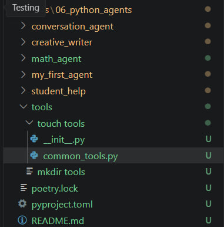
---
## 🤖 Власний агент (з дотриманням порад)

### 📌 Код агента

```python
from google.adk.agents.llm_agent import Agent

def safe_divide(a: float, b: float) -> dict:
    """Ділить два числа з перевіркою на нуль."""
    if b == 0:
        return {"error": "Ділення на нуль неможливе", "result": None}
    return {"result": a / b, "error": None}


def calculate_average(numbers: list) -> dict:
    """
    Обчислює середнє значення списку чисел.

    Args:
        numbers: список чисел

    Returns:
        dict: результат обчислення
    """
    if not numbers:
        return {"error": "Список порожній", "result": None}

    return {
        "result": sum(numbers) / len(numbers),
        "error": None
    }


root_agent = Agent(
    model="gemini-2.5-flash",
    name="safe_math_agent",
    description="Агент для безпечних математичних обчислень.",
    instruction="""
Ти математичний асистент.

Правила:
- Завжди перевіряй вхідні дані
- Використовуй інструменти для обчислень
- Відповідай українською мовою
- Пояснюй результат простими словами
- Якщо є помилка — поясни її

Формат відповіді:
- Результат
- Пояснення
""",
    tools=[safe_divide, calculate_average],
)
```
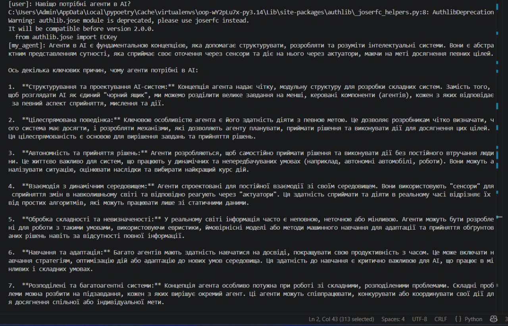
### 6. Stateful Agent
Функції:
- remember_fact()
- recall_fact()

Особливість: зберігає дані у JSON файл і памʼятає після перезапуску.
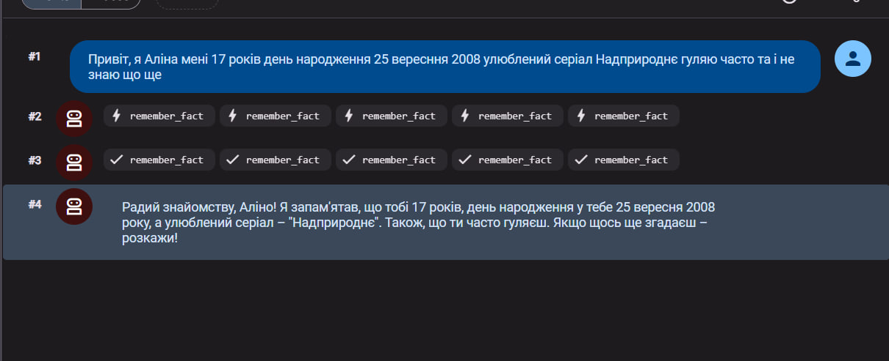
---

## 🔄 WORKFLOW АГЕНТИ

### Sequential
Виконує кроки по черзі:
1. аналіз
2. виконання
3. результат

Перевага: контроль процесу

---

### Loop
Повторює дії до досягнення якості  
exit_loop — функція завершення циклу

---

### Parallel
Виконує задачі одночасно

Перевага: швидкість виконання

---

## 📊 ПОРІВНЯННЯ

Sequential → порядок важливий  
Loop → покращення результату  
Parallel → швидкість  

---

## 🧪 ТЕСТУВАННЯ

Time Agent:
"Який час у Львові?" → HH:MM:SS

Math Agent:
5×10 = 50  
π×7² = ...  
3³ = 27  

Student Helper:
- декоратори
- list comprehension
- перевірка коду

---

## 🧠 ВИСНОВОК
Я навчився:
- створювати AI агентів через Google ADK
- працювати з tools (функціями-інструментами)
- налаштовувати інструкції для моделей
- використовувати Gemini API
- створювати агентів з памʼяттю
- працювати з Workflow (Sequential, Loop, Parallel)

## 📁 СТРУКТУРА ПРОЄКТУ
notes/06_python_agents/
- my_first_agent/
- math_agent/
- student_helper/
- creative_writer/
- conversation_agent/
- stateful_agent/
- tools/
- pyproject.toml
- poetry.lock

## ⚠️ ВАЖЛИВО
.env файли не додаються в Git  
API ключі завжди зберігати локально  

## 🔗 КОРИСНІ ПОСИЛАННЯ
Google ADK Documentation  
Google AI Studio  
Gemini API  
Poetry Documentation
